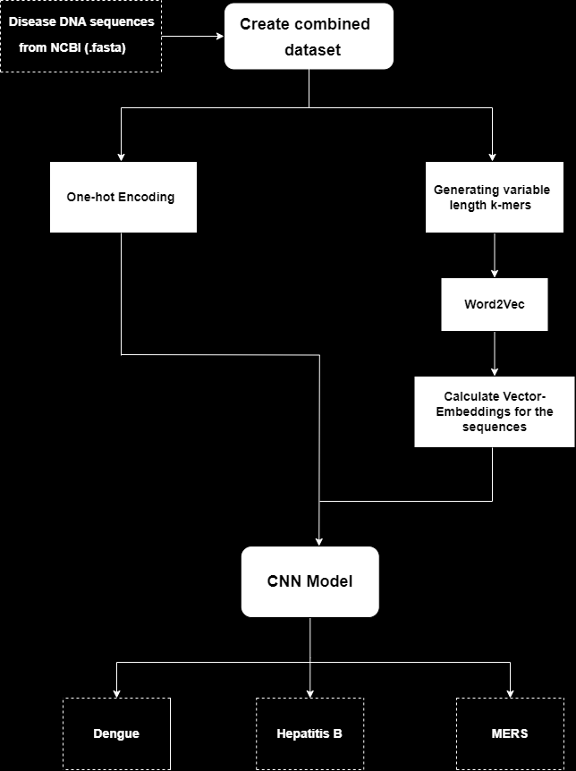

# Comparative Analysis of Word-Vector Embeddigs of DNA Genome Sequences

## Overview
This project explores a comparative analysis of various word vector embedding techniques used in genomic data classification in terms of overall accuracy, training time and computation overhead. The primary focus is on leveraging Convolutional Neural Networks (CNNs) integrated with word vector representations such as one-hot encoding and dna2vec to classify DNA sequences and identify disease-related patterns.

## Key Features

- **CNN-Based Classification:** A state-of-the-art CNN model is used to classify genomic sequences.
- **Comparative Analysis:** Comparison between one-hot encoding and dna2vec embeddings for DNA sequence classification.
- **Efficiency:** Highlights significant reductions in model training time using advanced embedding techniques.
- **Accurate Results:** Achieves over 98% accuracy in DNA sequence classification using optimized embeddings.

## Project Structure

1. **Dataset Collection:** DNA sequences related to diseases such as Dengue, Hepatitis B, and MERS were collected from the National Center for Biotechnology Information (NCBI).
2. **Word Vector Generation:**
- **One-Hot Encoding:** A simple binary encoding for representing DNA sequences.
- **dna2vec:** A vector-based representation using k-mers to capture semantic relationships between DNA subsequences.
3. **Model Architecture:** Comparison of one-hot encoding and dna2vec on performance metrics such as accuracy, loss, F1-score, and training time using CNN with Convolutional and MaxPooling layers for feature extraction and classification.
 
 
| Layer (Activation Function)   |   Output Shape   | Param #   |
|:---------------:|:--------------:|:------:|
| Conv1D (ReLU)   | (None, 98, 32) | 128    |
| MaxPooling1D    | (None, 49, 32) | 0      |
| Flatten         | (None, 1568)   | 0      |
| Dense (ReLU)    | (None, 64)     | 100416 |
| Dense (Softmax) | (None, 3)      | 195    |

**Total Trainable Parameters-** 100739

## Results
The model accuracy with One-hot encoding incrreases from 0.847 to 1.000 for training data and from 0.9368 to 0.9781 for validation data over 30 epochs.

The model accuracy with Dna2vec increases from 0.692 to 0.990 for training data and from 0.7132 to 0.9842 for validation data over 30 epochs.

**Performance metrics:**

|  Model  |  Accuracy  |  Loss  |  F1 Score  |  CNN Train Time  |
|:--------------------------|:-----:|:------:|:------:|:---------:|
| One-hot Encoding          | 97.45 | 0.1243 | 0.9745 | 1 minute  |
| dna2vec (klow=4, khigh=9) | 98.42 | 0.1568 | 0.9842 | 18 seconds|
| dna2vec (klow=3, khigh=10)| 98.54 | 0.1404 | 0.9854 | 19 seconds|
| dna2vec (klow=5, khigh=11)| 98.18 | 0.1986 | 0.9817 | 21 seconds|

## Conclusion

All three models using dna2vec achieve higher accuracy
than one-hot encoding. Specifically the dna2vec model with
klow=3 and khigh=10 achieves the highest accuracy of 98.54%.
We also notice a trend in training times with CNN. Onehot encoding takes the longest because it has a dataset with
dimensionality equal to the number of characters in a DNA
sequence. However at the same time the CNN model using
the dna2vec vector embeddings is much faster and takes only
about 18 seconds to train. This is because we represent each
DNA sequence as a vector with reduced feature space of N.
The value of N for this experiment was 100. Overall, the
dna2vec model with klow=4 and khigh=9 seems to be the best
model, as it has a good balance of accuracy, loss, and CNN
train time.

